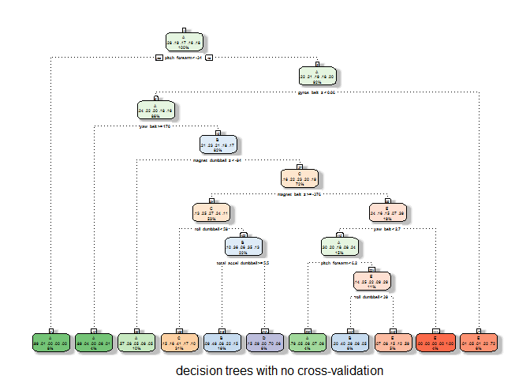
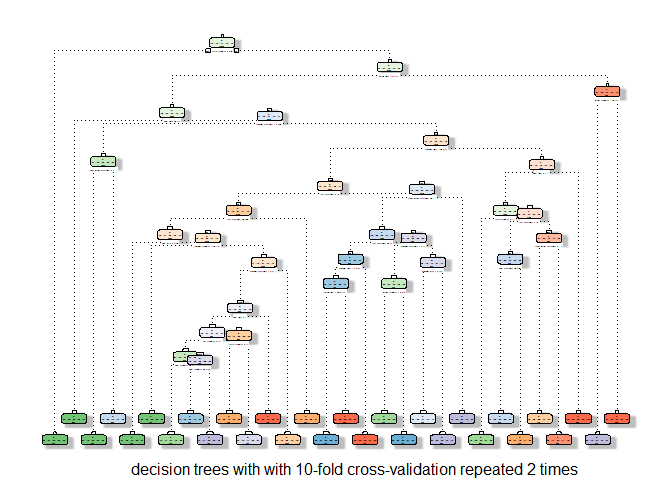

# JHU Practical Machine Learning Project
Ahmed Assal  
##Synopsis
Data were collected from sensors that are fixed to specific positions on the bodies of 6 participants. Particpants were asked to perfrom specific activities namely "10 repetitions of the Unilateral Dumbbell Biceps Curl in five different fashions". The data collected from the sensors will be used in this study to tell whether those activities were performed properly or not. More specifically, the study aims to build a machine learning model that can predict how excellent were the performance of these activities and classify it as A for an excellent performance or B,C,D,and E for different types of erratic performances.

##Background
Using devices such as Jawbone Up, Nike FuelBand, and Fitbit it is now possible to collect a large amount of data about personal activity relatively inexpensively. These type of devices are part of the quantified self movement – a group of enthusiasts who take measurements about themselves regularly to improve their health, to find patterns in their behavior, or because they are tech geeks. One thing that people regularly do is quantify how much of a particular activity they do, but they rarely quantify how well they do it. In this project, your goal will be to use data from accelerometers on the belt, forearm, arm, and dumbell of 6 participants. They were asked to perform barbell lifts correctly and incorrectly in 5 different ways. More information is available from the website here: http://groupware.les.inf.puc-rio.br/har (see the section on the Weight Lifting Exercise Dataset). 

###Data
The training data for this project are available here: 
https://d396qusza40orc.cloudfront.net/predmachlearn/pml-training.csv
The test data are available here: 
https://d396qusza40orc.cloudfront.net/predmachlearn/pml-testing.csv
The data for this project come from this source: http://groupware.les.inf.puc-rio.br/har. If you use the document you create for this class for any purpose please cite them as they have been very generous in allowing their data to be used for this kind of assignment.

###Study objective
The goal of this project is to predict the manner in which they did the exercise. This is the "classe" variable in the training set. You may use any of the other variables to predict with. You should create a report describing how you built your model, how you used cross validation, what you think the expected out of sample error is, and why you made the choices you did. You will also use your prediction model to predict 20 different test cases. 

###Author notes
For full reproducibility, the packages below should be installed first, and then the application will set the random number generator seed to 1235. 

##Study and results
###The problem
Data were collected from sensors that are fixed to specific positions on the bodies of 6 participants. Particpants were asked to perfrom specific activities namely "10 repetitions of the Unilateral Dumbbell Biceps Curl in five different fashions". The data collected from the sensors will be used in this study to tell whether those activities were performed properly or not. More specifically, the study aims to build a machine learning model that can predict how excellent were the performance of these activities and classify it as "A" for an excellent performance or "B","C","D",and "E" for different types of erratic performances.

###The model
This problem is classification problem that lends itself to classification algorithms. It should be noted here that the number of variables in the dataset is large ~ 160 which may impact some of the following: classification success and accuracy, and/or speed of computations. First, by investigating different algorithms for classification in addition to the original research of the paper titled "10 repetitions of the Unilateral Dumbbell Biceps Curl in five different fashions", decision trees and random forests were chosen from the most famous algorithms for classification. Second, I cleaned the data by removing columns that contained NAs, that had bad values, that have zero/near-zero variance or  that were irrelevant to the study. The cleanning of data has resulted in reducing the number of variables to 32 variables that can be used as predictors. Next, decision trees and random forests algorithms have detected the proper features to use for prediction. Finally, in order to minimize the time required for the computations, I used 2 repetitions for the 10-fold and 3-fold repeated cross-validation.   

###Data Processing
####Loading packages

```r
library(caret)
```

```
## Loading required package: lattice
## Loading required package: ggplot2
```

```r
library(ggplot2)
library(dplyr)
```

```
## 
## Attaching package: 'dplyr'
## 
## The following object is masked from 'package:stats':
## 
##     filter
## 
## The following objects are masked from 'package:base':
## 
##     intersect, setdiff, setequal, union
```

```r
library(rattle)
```

```
## Rattle: A free graphical interface for data mining with R.
## Version 3.4.1 Copyright (c) 2006-2014 Togaware Pty Ltd.
## Type 'rattle()' to shake, rattle, and roll your data.
```

```r
library(rpart)
library(rpart.plot)
```
####Initializations
Setting the seed for the psueo-number generator to ensure reproducibility.  

```r
rm(list=ls())
# setting the seed generator number for rerpoducibility
set.seed(1235)
```
####Loading training and testing data

```r
# Downloading the training data
#trainingFile.url = "https://d396qusza40orc.cloudfront.net/predmachlearn/pml-training.csv"
#trainingFile=download.file(url=trainingFile.url, destfile=trainingDestfile)
trainingDestfile=".//pml-training.csv"
trainingDataRaw = read.csv(file=trainingDestfile)

# Downloading the testing data
#testingFile.url = "https://d396qusza40orc.cloudfront.net/predmachlearn/pml-testing.csv"
#testingFile=download.file(url=testingFile.url, destfile=testingDestfile)
testingDestfile=".//pml-testing.csv"
testingDataRaw = read.csv(file=testingDestfile)

rm(trainingDestfile, testingDestfile)

#Total number of variables 160 after this stage
```

####Data Cleaning
The first seven variables are irrelevant to this study, e.g, timestamps, user ids, etc... Also, variables that had NA values. After removing these variables, the number of possible predictors have come down to 86 variables.  


```r
# Cleaning the training set
# deleting columns with NAs
trainingDataClean = trainingDataRaw[,colSums(is.na(trainingDataRaw)) == 0]
# Columns 1-7 are irrelevant to our study
irrelevant_indices = 1:7
relevant_indices = - irrelevant_indices
trainingDataClean = trainingDataClean[,relevant_indices]

# Cleaning the testing set
# deleting columns with NAs
testingDataClean = testingDataRaw[,colSums(is.na(testingDataRaw)) == 0]
# Columns 1-7 are irrelevant to our study
irrelevant_indices = 1:7
relevant_indices = - irrelevant_indices
testingDataClean = testingDataClean[,relevant_indices]
rm(trainingDataRaw, testingDataRaw, irrelevant_indices, relevant_indices)
#Total number of variables after this stage, training set: 86 and for intermediate testing: N/A #Testing set: 53
```

####Data Splitting
The partitioning of the training dataset into a training set of 75% of the original data and a testing set of the remaining %25. The training partition will be used for training while the second partition is used for adjustments and estimation for out of sample errors.  

```r
inTrain = createDataPartition(y=trainingDataClean$classe, p=0.75, list= FALSE)
training = trainingDataClean[inTrain,]
testing = trainingDataClean[-inTrain,]

dim(training); dim(testing)
```

```
## [1] 14718    86
```

```
## [1] 4904   86
```

```r
# Initializing the variables for the data to be used in training
# Data Alternative A
trainingStep = training
# Data Alternative B
trainingStepB = training
rm(training, inTrain)

#Total number of variables after this stage, training set A 86 / training set B 86
#Testing set: 53
```

####Removing zero- and near-zero-variance variables
Variables that have zero or near-zero variance are removed also to further decrease the number of possible predictors to 53 variables.  

```r
# Removing variables that have zero or near-zero variance
nzv = nearZeroVar(trainingStep, saveMetrics = TRUE)
trainingNZV = trainingStep[, !nzv$zeroVar & !nzv$nzv ]
dim(trainingNZV)
```

```
## [1] 14718    53
```

```r
trainingStep = trainingNZV
rm(nzv, trainingNZV)

nzvB = nearZeroVar(trainingStepB, saveMetrics = TRUE)
trainingNZVB = trainingStepB[, !nzvB$zeroVar & !nzvB$nzv ]
dim(trainingNZVB)
```

```
## [1] 14718    53
```

```r
trainingStepB = trainingNZVB
rm(nzvB, trainingNZVB)

#Total number of variables after this stage, training set A 53 / training set B 53
#Testing set: 53
```

####Removing highly correlated variables
In this preprocessing step, variables that are highly correlated are removed from the dataset to further reduce redundancy and decrease the number of predictors to 33 variables.   

```r
# Removing highly correlated variables
# training data set A
# removing the classe variable
trainingTemp = trainingStep[,-53]
descrCor <- cor(trainingTemp)
highlyCorrIndices = findCorrelation(descrCor, cutoff = 0.75)
trainingCor = trainingTemp[,-highlyCorrIndices]
# adding the classe variable back
trainingCor$classe = trainingStep$classe
trainingStep = trainingCor

# training data set B
# removing the classe variable
trainingTempB = trainingStepB[,-53]
descrCorB <- cor(trainingTempB)
highlyCorrIndicesB = findCorrelation(descrCorB, cutoff = 0.75)
trainingCorB = trainingTempB[,-highlyCorrIndicesB]
# adding the classe variable back
trainingCorB$classe = trainingStepB$classe
trainingStepB = trainingCorB

rm(trainingCor, trainingCorB, trainingTemp, trainingTempB, descrCor, descrCorB, highlyCorrIndices, highlyCorrIndicesB)

#Total number of variables after this stage, training set A 33 / training set B 33
#Testing set: 53
```

###Choosing final training data
After preprocessing the training data, 3 copies of these sets were assigned to differed track of experimentation, namely, decision trees without cross-validation, decision trees with repeated cross-validation and finally random forests with reapeated cross-validation.   


```r
# Training data A for decision trees with no cross-validation
trainingSemifinal = trainingStep

# Training data B for decision trees with 10-fold cross-validation repeated 2 times
trainingSemifinalB = trainingStepB

# Training data C for random forests with 3-fold cross-validation repeated 2 times
trainingSemifinalC = trainingStepB

rm(trainingStep, trainingStepB)

#Total number of variables after this stage, training set A 33 / training set B 33 / 
#training set C 33
#Testing set: 53
```

###Training
####Training using decision trees with no cross-validation
#####Training Process

```r
modelFit <- train(classe ~ .,method="rpart",data=trainingSemifinal)
fancyRpartPlot(modelFit$finalModel, sub = "decision trees with no cross-validation")   
```

 

#####Pedictions   

```r
predicted = predict(modelFit, newdata=testing)
confusionMatrix(predicted, testing$classe)
```

```
## Confusion Matrix and Statistics
## 
##           Reference
## Prediction    A    B    C    D    E
##          A 1012  146   29   50   27
##          B  131  514  132  186  158
##          C  207  231  649  277  147
##          D   30   27    1  211   20
##          E   15   31   44   80  549
## 
## Overall Statistics
##                                           
##                Accuracy : 0.5985          
##                  95% CI : (0.5846, 0.6123)
##     No Information Rate : 0.2845          
##     P-Value [Acc > NIR] : < 2.2e-16       
##                                           
##                   Kappa : 0.4931          
##  Mcnemar's Test P-Value : < 2.2e-16       
## 
## Statistics by Class:
## 
##                      Class: A Class: B Class: C Class: D Class: E
## Sensitivity            0.7254   0.5416   0.7591  0.26244   0.6093
## Specificity            0.9282   0.8465   0.7871  0.98098   0.9575
## Pos Pred Value         0.8006   0.4585   0.4295  0.73010   0.7636
## Neg Pred Value         0.8948   0.8850   0.9393  0.87151   0.9159
## Prevalence             0.2845   0.1935   0.1743  0.16395   0.1837
## Detection Rate         0.2064   0.1048   0.1323  0.04303   0.1119
## Detection Prevalence   0.2577   0.2286   0.3081  0.05893   0.1466
## Balanced Accuracy      0.8268   0.6941   0.7731  0.62171   0.7834
```
Decision trees without cross validation had low accuracy.   

####Training using decision trees with 10-fold cross-validation repeated 2 times
#####Training Process

```r
ctrlB = trainControl(method="repeatedcv", number = 10, repeats = 2)
modelFitB <- train(classe ~., data = trainingSemifinalB, method="rpart", tuneLength = 15, trControl=ctrlB)
fancyRpartPlot(modelFitB$finalModel, sub = "decision trees with with 10-fold cross-validation repeated 2 times")
```

```
## Warning: labs do not fit even at cex 0.15, there may be some overplotting
```

 

#####Pedictions   

```r
predictedB = predict(modelFitB, newdata=testing)
confusionMatrix(predictedB, testing$classe)
```

```
## Confusion Matrix and Statistics
## 
##           Reference
## Prediction    A    B    C    D    E
##          A 1204   90   20   47   16
##          B  108  610   83   71   66
##          C   33  150  712  161  124
##          D   46   72   34  498   52
##          E    4   27    6   27  643
## 
## Overall Statistics
##                                           
##                Accuracy : 0.7478          
##                  95% CI : (0.7354, 0.7599)
##     No Information Rate : 0.2845          
##     P-Value [Acc > NIR] : < 2.2e-16       
##                                           
##                   Kappa : 0.6812          
##  Mcnemar's Test P-Value : < 2.2e-16       
## 
## Statistics by Class:
## 
##                      Class: A Class: B Class: C Class: D Class: E
## Sensitivity            0.8631   0.6428   0.8327   0.6194   0.7137
## Specificity            0.9507   0.9171   0.8844   0.9502   0.9840
## Pos Pred Value         0.8744   0.6503   0.6034   0.7094   0.9095
## Neg Pred Value         0.9458   0.9145   0.9616   0.9272   0.9385
## Prevalence             0.2845   0.1935   0.1743   0.1639   0.1837
## Detection Rate         0.2455   0.1244   0.1452   0.1015   0.1311
## Detection Prevalence   0.2808   0.1913   0.2406   0.1431   0.1442
## Balanced Accuracy      0.9069   0.7799   0.8586   0.7848   0.8488
```
Decision trees with repeated cross-validation had moderate accuracy.   

####Training using random forests with 3-fold cross-validation repeated 2 times
#####Training Process
I have tried different parameters for the repeated cross-validation with random forests. The first took long times in training so I changed the repated-cv to 3-fold with 2 repetitions only.   

```r
# Too much time for 10-cv with 10 repetitions
#ctrlC = trainControl(method="repeatedcv", number = 10, repeats = 10)
#modelFitC <- train(classe ~., data = trainingSemifinalB, method="rf", tuneLength = 10, trControl=ctrlC, verbose = TRUE, trace = TRUE)

# Moderate acceptable time for 3-cv with 2 repetitions
ctrlC = trainControl(method="repeatedcv", number = 3, repeats = 2)
modelFitC <- train(classe ~., data = trainingSemifinalC, method="rf", tuneLength = 2, trControl=ctrlC)
```

#####Predictions  

```r
predictedC = predict(modelFitC, newdata=testing)
confusionMatrix(predictedC, testing$classe)
```

```
## Confusion Matrix and Statistics
## 
##           Reference
## Prediction    A    B    C    D    E
##          A 1395    6    0    0    0
##          B    0  942    6    0    0
##          C    0    1  845   24    0
##          D    0    0    4  776    3
##          E    0    0    0    4  898
## 
## Overall Statistics
##                                          
##                Accuracy : 0.9902         
##                  95% CI : (0.987, 0.9928)
##     No Information Rate : 0.2845         
##     P-Value [Acc > NIR] : < 2.2e-16      
##                                          
##                   Kappa : 0.9876         
##  Mcnemar's Test P-Value : NA             
## 
## Statistics by Class:
## 
##                      Class: A Class: B Class: C Class: D Class: E
## Sensitivity            1.0000   0.9926   0.9883   0.9652   0.9967
## Specificity            0.9983   0.9985   0.9938   0.9983   0.9990
## Pos Pred Value         0.9957   0.9937   0.9713   0.9911   0.9956
## Neg Pred Value         1.0000   0.9982   0.9975   0.9932   0.9993
## Prevalence             0.2845   0.1935   0.1743   0.1639   0.1837
## Detection Rate         0.2845   0.1921   0.1723   0.1582   0.1831
## Detection Prevalence   0.2857   0.1933   0.1774   0.1597   0.1839
## Balanced Accuracy      0.9991   0.9956   0.9911   0.9817   0.9978
```
Random forests with repeated cross-validation has the highest accuracy.   

###Writing answers to files

```r
answers = predict(modelFitC, newdata=testingDataClean)
pml_write_files = function(x){
  n = length(x)
  for(i in 1:n){
    filename = paste0("problem_id_",i,".txt")
    write.table(x[i],file=filename,quote=FALSE,row.names=FALSE,col.names=FALSE)
  }
}

pml_write_files(answers)
```

###Results   
####Model Evaluation   
Random Forests algorithm has outperformed Decision Trees algorithm whether repeated cross-validation is used or not. Accuracy for Random Forest model was around 0.99 [95% CI (0.987, 0.9928] compared to around 0.75 95% CI: (0.7354, 0.7599)] for Decision Tree models w/ cross-validation. I have chosen the random forests algorithm for its higher accuracy.   

####Out of sample error   
For the random Forest model which is choosen, the accuracy of the model is 0.9902. The out of sample error is the error rate for the predictions made based on the new test data out of the training set. In order to estimate this error, the training data has been partitioned such that %25 of this set is used for testing once to correctly estimate the error. This is calculated as 1 - accuracy for the predictions based on this testing set. The expected out-of-sample error is estimated at 0.01, or 1%.   

##Conclusion
This report shows different experimentations with different classification algorithms such as decision trees and random forests in order to classify which activities were exercised in excellent performance and which were exercised in bad performance. After some exploratory data analysis, random forests algorithm were found to be of higher accuracy over decision trees. The trainnig data were then partitioned into a training set and a testing set. Both were cleaned by removing variables that had NA or malformed values. Also, variables that had zero or near-zero variance and those that were highly correlected are removed from the training set to further reduce the number of predictors to 33 variables. After using the preprocessed training set with the random forests algorithm, the classification were succsseful at a high accuracy rate of %99 while the out of sample error is estimated at 1%.   
